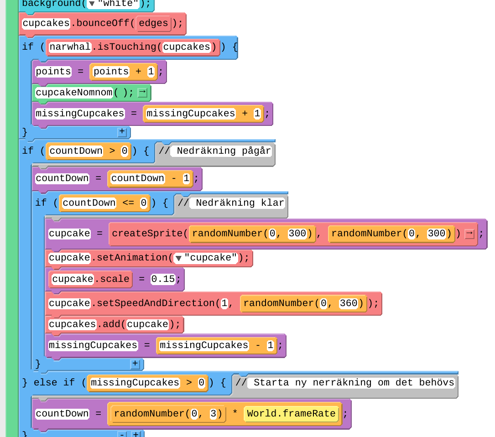

# Flygande valen i GameLab

På <a href="https://code.org" target="_blank">code.org:s hemsida</a> finns programmeringsmiljön GameLab som är blockprogrammering med programspråket
JavaScript.

<a href="https://www.kodboken.se/start/skapa-spel/uppgifter-i-scratch/flygande-valen?chpt=1" target="_blank">Vi utgår från Flygande valen.</a>
Gör det projektet först, **i Scratch**, så att du har det färskt i minne!

Sen behöver du ordna ett konto på code.org så att du kan spara och dela ditt nya GameLab-projekt som vi ska göra nu.

Här är min version av spelet som du kan testa: <a href="https://studio.code.org/projects/gamelab/8wmRVfcKHVP-5ObbY5NiPG3ISYZEYwuK_F-Xr0af0v4" target="_blank">https://studio.code.org/projects/gamelab/8wmRVfcKHVP-5ObbY5NiPG3ISYZEYwuK_F-Xr0af0v4</a>


## 1: En val som följer muspekaren
1. Gå in på hemsidan code.org och välj “Game Lab” i Skapa-menyn. Du får ett tomt projekt.
2. Gå till *Animations*-menyn. Rita en egen val eller leta upp en fri bild på t.ex. en narval. Pröva att Googla “narwhal cc0”. Spara bilden och ladda upp den till GameLab. Döp bilden till “narwhal” i rutan under.


För att valen ska synas, behöver vi skriva några rader kod. Sprajten behöver skapas och sedan ritas i funktionen draw. Nästan alla program i GameLab kommer att börja så här:


Starta koden med Kör-knappen.

3. Valen ska inte vara för stor. Se bilden överst i dokumentet. Sätt valens storlek med blocket `sprite.scale`. Dra in blocket och fyll i namn och storlek på sprajten. I mitt fall ser storleken 0.1 bra ut, vilket motsvarar längdskala 10%.


4. Uppdatera koden så att valen pekar mot muspekaren eller där du trycker på pekskärmen. Det behövs en bakgrund också. Bakgrunden kan vara en bild men vi börjar med bara vit färg.


5. --

6. Startpositionen har vi redan satt med när vi gör `createSprite`.

7. För att valen inte ska hoppa omkring gör vi en kontroll inne i funktionen `draw`.

8. GameLab har inget block för att räkna ut avstånd mellan två sprajtar. Vi gör ett eget funktionsblock som vi kallar `distance`. Vi använder <a href="https://nzmaths.co.nz/resource/gougu-rule-or-pythagoras-theorem" target="_blank">Pythagoras sats/Gougus regel</a> för att räkna ut avståndet mellan en sprajt och en punkt *(x, y)*. Om avståndet till muspekaren är 10 pixlar eller mindre sätter vi hastigheten till 0. Därför behöver vi flytta in `narwhal.setSpeedAndDirection` in i `draw`-funktionen.


Nu behöver vi bara funktionen för att räkna ut hypotenusan enligt figuren, alltså den streckade linjen:


Vi behöver ett sätt att räkna ut hypotenusan i triangeln. Du kan mata in koden så här i blocket return så kommer den sen att visas rätt när du trycker på Enter.


Så här ser det ut när du tryckt på Enter:


Visar du det som text ser det ut så här:
```javascript
function hypot(x, y) {
  return Math.pow(x * x + y * y, 0.5);
}
```

En av styrkorna med GameLab är att man kan byta mellan block och textkod.
Vissa saker kan vara lättare att mata in som textkod. 
Du byter genom att klicka på knappen *Visa text* uppe till höger. Så här ser koden ut nu i textform.


```javascript
// Förbered
var narwhal = createSprite(200, 200);
narwhal.setAnimation("narwhal");
narwhal.scale = 0.1;
narwhal.rotateToDirection = true;
// Rita
function draw() {
  background("white");
  narwhal.pointTo(World.mouseX, World.mouseY);
  if (distance(narwhal, World.mouseX, World.mouseY) > 10) {
    narwhal.setSpeedAndDirection(1, narwhal.getDirection());
  } else {
    narwhal.setSpeedAndDirection(0, narwhal.getDirection());
  }
  drawSprites();
}
// Hjälpfunktioner
function distance(sprite, x, y) {
  return hypot(x - sprite.x, y - sprite.y);
}
function hypot(x, y) {
  return Math.pow(x * x + y * y, 0.5);
}
```

Sen kan du byta tillbaks till block med knappen *Visa block*.


## 2: En himmel som bakgrund

10. Vi har redan lagt in en vit bakgrund. Du kan lägga in bakgrundssprajt genom att helt enkelt lägga till en sprajt först i din kod. Sprajtarna ritas i den ordning vi skapar dem med `createSprite`. Vi skapar bakgrunden först, före narvalen. Bilden *Pine trees* hittar du i AppLabs bibliotek med animeringar.


11. Detta gjorde vi i steg 9.

12. Du kan lägga till moln genom att söka på *Cloud* i animeringsbiblioteket.
Så här kan spelet se ut nu, utan moln.


## 3: Munkar att äta
13. Det finns ingen munk (donut) i animeringsbiblioteket men en cupcake är väl lika nyttig :) så vi lägger in den i *Animations* och kallar den `cupcake`. 


Vi lägger också till `CreateSprite`, `setAnimation` och `scale` för att få rätt storlek. Vi använder `randomNumber` för att vår cupcake ska dyka upp på en slumpmässig *x*- och *y*-position när den skapas.


14. Detta gjorde vi i steg 12.

15. Vi sätter hastigheten på vår cupcake som innan med `setSpeedAndDirection`. Vi passar också på att sätta en slumpmässig riktning som den startar i.
För att få vår cupcake att studsa vid kanten behöver vi använda `createEdgeSprites`. Kolla exemplen för det blocket i GameLab: LÄNK. Inne i draw ska vi också komma ihåg att studsa vid kanterna. Så här kan det se ut:


Så här ser hela koden ut nu:

```javascript
// Förbered
var backgroundSprite = createSprite(200, 200);
backgroundSprite.setAnimation("pine_trees");
var narwhal = createSprite(200, 200);
narwhal.setAnimation("narwhal");
narwhal.scale = 0.1;
narwhal.rotateToDirection = true;
var cupcake = createSprite(randomNumber(0, 300), randomNumber(0, 300));
cupcake.setAnimation("cupcake");
cupcake.scale = 0.15;
cupcake.setSpeedAndDirection(1, randomNumber(0, 360));
createEdgeSprites(); // Skapar variabeln (sprajten) edges
// Rita
function draw() {
  background("white");
  cupcake.bounceOff(edges);
  narwhal.pointTo(World.mouseX, World.mouseY);
  if (distance(narwhal, World.mouseX, World.mouseY) > 10) {
    narwhal.setSpeedAndDirection(1, narwhal.getDirection());
  } else {
    narwhal.setSpeedAndDirection(0, narwhal.getDirection());
  }
  drawSprites();
}
// Hjälpfunktioner
function distance(sprite, x, y) {
  return hypot(x - sprite.x, y - sprite.y);
}
function hypot(x, y) {
  return Math.pow(x * x + y * y, 0.5);
}
```

## 4: Valen äter munkar

16. I GameLab finns det inget enkelt sätt att känna av om en sprajt rör vid en färg. Vi testar att känna av om vår cupcake rör narvalen som en första idé. Det får vi göra inne i `draw` som vanligt.
Vi vill att `cupcake` ska gömma sig tre sekunder när narvalen rör den. Därför sätter vi räknaren `countdown` till 3 gånger vår framerate (FPS). Sen räknar vi ner den varje gång vi är i `draw`. När rätt antal frames (rutor) har gått, så skapar vi `cupcake` igen så att den syns.
Att sätta `cupcake.visible = false` räcker inte eftersom vi fortfarande kan röra en osynlig sprajt. Därför förstör vi sprajten och skapar en ny.


17. Se 15
18. Se 15
19. Se 15

Här är hela koden som text:
```javascript
// Förbered
var backgroundSprite = createSprite(200, 200);
backgroundSprite.setAnimation("pine_trees");
var narwhal = createSprite(200, 200);
narwhal.setAnimation("narwhal");
narwhal.scale = 0.1;
narwhal.rotateToDirection = true;
var cupcake = createSprite(randomNumber(0, 300), randomNumber(0, 300));
cupcake.setAnimation("cupcake");
cupcake.scale = 0.15;
cupcake.setSpeedAndDirection(1, randomNumber(0, 360));
createEdgeSprites(); // Skapar variabeln (sprajten) edges
var countDown = 0;
// Rita
function draw() {
  background("white");
  cupcake.bounceOff(edges);
  if (narwhal.isTouching(cupcake)) {
     cupcake.destroy();
     countDown = 3 * World.frameRate;
  }
  if (countDown > 0) { // Nedräkning pågår
    countDown = countDown - 1;
    if (countDown <= 0) { // Nedräkning klar
      cupcake = createSprite(randomNumber(0, 300), randomNumber(0, 300));
      cupcake.setAnimation("cupcake");
      cupcake.scale = 0.15;
      cupcake.setSpeedAndDirection(1, randomNumber(0, 360));
    }
  }
  narwhal.pointTo(World.mouseX, World.mouseY);
  if (distance(narwhal, World.mouseX, World.mouseY) > 10) {
    narwhal.setSpeedAndDirection(1, narwhal.getDirection());
  } else {
    narwhal.setSpeedAndDirection(0, narwhal.getDirection());
  }
  drawSprites();
}
// Hjälpfunktioner
function distance(sprite, x, y) {
  return hypot(x - sprite.x, y - sprite.y);
}
function hypot(x, y) {
  return Math.pow(x * x + y * y, 0.5);
}
```

## 5. Poäng för att äta munkar

20. Vi har redan en plats i `draw` där vi kan räkna poäng. GameLab har inget sätt att skicka meddelanden mellan sprajtar utan vi använder vanliga variabler. Öka variabeln `points` med 1 när narvalen äter.


21. Poängräknaren behöver deklareras med `var` innan vi använder den. Nollställ den också.


Vi skriver ut värdet varje gång i slutet av `draw` så här. *(25, 25)* är koordinaterna på skärmen där texten ska stå.


Eftersom `drawSprites` ritar om hela spelytan, behöver vi skriva ut poängen efter sprajtarna så den hamnar överst även om det skulle vara sprajtar i övre vänstra hörnet. “+”-tecknet i `text`-blocket lägger ihop texten “Poäng: ” med variabeln som räknar poängen.

22. Se 20

23. Se 20

24. Se 20


25. Nu vill vi ha flera `cupcake`-sprajtar. Så här ser planen ut:

  a. Vi gör en sprajt-grupp som vi kallar `cupcakes` och där lägger vi in flera cupcakes som vi skapar. Här är de två block vi behöver.


  b. GameLab kan känna av om narvalen krockar med någon sprajt i gruppen på samma sätt som när vi bara hade en cupcake.

  c. GameLab har inget sätt att berätta exakt vilken cupcake som nuddade narvalen. Vi får gå igenom gruppen `cupcakes` och hitta vilken sprajt som valen åt och sen ta bort den ur gruppen. Vi gör en funktion som vi kallar `cupcakeNomnom`

  d. Att ha en timer på 3 sekunder för varje uppäten cupcake blir krångligt. Vi nöjer oss så länge med att hålla reda på hur många cupcake som syns just nu och så skapar vi nya med en viss fördröjning, inuti `draw`.

Nu sätter vi igång!

Vi lägger till gruppen `cupcakes` och ser till att den får fem sprajtar. Vi upprepar samma kod fem gånger med ett `for`-block. Vi gör också så att gruppen `cupcakes` studsar mot kanterna. Då kommer varje cupcake i gruppen att hålla sig inne på spelplanen automatiskt.


Ändra så att narvalen känner av gruppen `cupcakes` och anropar funktionen `cupcakeNomnom`, som letar upp vilken cupcake som blev uppäten.


Längst ner lägger vi till funktionen `cupcakeNomnom`:


Uppätna cupcakes ska ju ersättas av nya efter ett tag. 
Vi lägger till variabeln `missingCupcakes` för att hålla reda på hur många som saknas. När en cupcake äts upp ökar vi den och när en ny dyker upp minskar vi den. 
Variabeln `countDown` håller reda på när nästa cupcake ska dyka upp. Inuti funktionen `draw` har vi nu den här koden för cupcake: 


Här kommer till slut all koden på en gång. Det ser mycket ut, men precis som ett bakverk eller maträtt så blir det lättare om man vet vilka steg som ligger bakom och tar en ingrediens i taget. Den här koden kan du klippa och klistra in i textfönstret i GameLab om du vill. 

För att minska upprepningar har jag lagt till funktionen `newCupcake()` nere bland hjälpfunktionerna. Den ger oss en ny cupcake, som vi behöver på två ställen i koden.

```javascript
// Förbered
var backgroundSprite = createSprite(200, 200);
backgroundSprite.setAnimation("pine_trees");
var narwhal = createSprite(200, 200);
narwhal.setAnimation("narwhal");
narwhal.scale = 0.1;
narwhal.rotateToDirection = true;
var cupcakes = createGroup();
var cupcakeCount = 5;
var missingCupcakes = 0;
for (var i = 0; i < cupcakeCount; i = i + 1) {
  cupcakes.add(newCupcake());
}
createEdgeSprites(); // Skapar variabeln (sprajten) edges
var countDown = 0;
var points = 0;
// Rita
function draw() {
  background("white");
  cupcakes.bounceOff(edges);
  if (narwhal.isTouching(cupcakes)) {
    points = points + 1;
    cupcakeNomnom();
    missingCupcakes = missingCupcakes + 1;
  }
  if (countDown > 0) { // Nedräkning pågår
    countDown = countDown - 1;
    if (countDown <= 0) { // Nedräkning klar
      cupcakes.add(newCupcake());
      missingCupcakes = missingCupcakes - 1;
    }
  } else if (missingCupcakes > 0) { // Starta ny nedräkning om det behövs
    countDown = randomNumber(0, 3) * World.frameRate;
  }
  narwhal.pointTo(World.mouseX, World.mouseY);
  if (distance(narwhal, World.mouseX, World.mouseY) > 10) {
    narwhal.setSpeedAndDirection(1, narwhal.getDirection());
  } else {
    narwhal.setSpeedAndDirection(0, narwhal.getDirection());
  }
  drawSprites();
  textSize(20);
  text("Poäng: " + points, 25, 25);
}
// Hjälpfunktioner
function newCupcake() {
  var cupcake = createSprite(randomNumber(0, 300), randomNumber(0, 300));
  cupcake.setAnimation("cupcake");
  cupcake.scale = 0.15;
  cupcake.setSpeedAndDirection(1, randomNumber(0, 360));
  return cupcake;
}
function cupcakeNomnom() {
  // Hitta, ta bort och kompostera uppäten cupcake ur gruppen cupcakes
  for (var i = 0; true; i = i + 1) { // Gå igenom alla
    var c = cupcakes.get(i);
    if (c != null) { // Det finns en cupcake på plats i
      if (narwhal.isTouching(c)) { // Kolla om den äts upp
        cupcakes.remove(c);
        c.destroy();
        return true;
      }
    } else {
      return false; // Vi är klara!
    }
  }
}
function distance(sprite, x, y) {
  return hypot(x - sprite.x, y - sprite.y);
}
function hypot(x, y) {
  return Math.pow(x * x + y * y, 0.5);
}
```

## Jobba vidare
1. Lägg till ljud när valen äter. Använd World.playSound: 

Använd något av de färdiga ljuden i GameLab.

2. Dela länken till ditt spel och låt någon testa åt dig.

3. Fungerar spelet bra på en mindre skärm, t.ex. din mobil? Något att förbättra?

4. Lägg till moln som kanske kan vara farliga för valen?


## Flera minispel att kolla in på GameLab
Det finns många olika minispel gömda i hjälpen för de olika blocken. Klicka på länken “See examples” när du navigerar bland blocken. Testa t.ex. de här:
* Blocket `group.bounce` med exemplet “Bounce the Burger”
* Blocket `group.bounceOff` med exemplet “Pig Catch”


Du kan kopiera textkoden från ett exempel och ha den som början på ett eget spel.


## Kuriosa eller kul att veta
1. De här två blocken fungerar likadant: de ökar variabeln points med 1. Den andra varianten, som är kortare, kan du bara mata in via text men när du byter till block visas det rätt. 


2. I JavaScript finns funktionen `Math.hypot` men den saknas i GameLab.

3. Funktionen `Math.pow()` finns bland förslagen när du kör GameLab i textläge men motsvarande block saknas.
